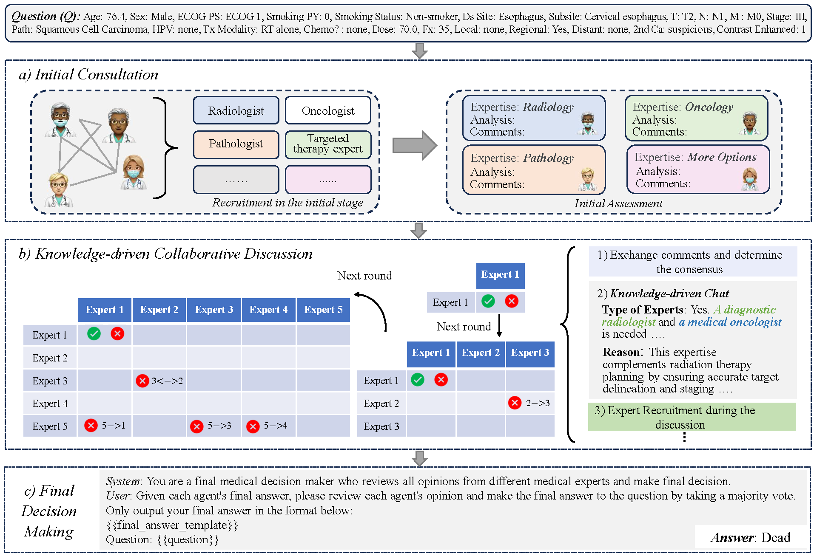

# A Knowledge-driven Adaptive Collaboration of LLMs for Enhancing Medical Decision-making

<p align="center">
  <em>Under review at ACL ARR May 2025</em>
</p>

Medical decision-making often involves integrating knowledge from multiple clinical specialties, typically achieved through multidisciplinary teams. Inspired by this collaborative process, recent work has leveraged large language models (LLMs) in multi-agent collaboration frameworks to emulate expert teamwork. While these approaches improve reasoning through agent interaction, they are limited by static, pre-assigned roles, which hinder adaptability and dynamic knowledge integration. To address these limitations, we propose KAMAC, a **Knowledge-driven Adaptive Multi-Agent Collaboration** framework that enables LLM agents to dynamically form and expand expert teams based on the evolving diagnostic context. KAMAC begins with one or more expert agents and then conducts a knowledge-driven discussion to identify and fill knowledge gaps by recruiting additional specialists as needed. This supports flexible, scalable collaboration in complex clinical scenarios, with decisions finalized through reviewing updated agent comments.
Experiments on two real-world medical benchmarks demonstrate that KAMAC significantly outperforms both single-agent and advanced multi-agent methods, particularly in complex clinical scenarios (*i.e.*, cancer prognosis) requiring dynamic, cross-specialty expertise.


<p align="center">
  
</p>

## 🚀 Quick Start

### 1. Install Dependencies
```bash
~$ pip install -r requirements.txt
```


### 2. Set up API keys:
```bash
~$ export OPENAI_API_KEY="your_api_key_here"
~$ export DEEPSEEK_API_KEY="your_api_key_here"
~$ export CLAUDE_API_KEY="your_api_key_here"
```

You can also set up Ollama for inference without additional changes: 

```bash
~$ ollama serve
```


### 3. Download dataset: 
* **MedQA** can be loaded directly from ``data/``.

* **RADCURE** (≈500GB zipped) includes images and must be manually placed in the ``data/`` directory. The JSON file have been provided in ``data/``.

## 🔍 Inference


### 1. Reproduce Final Results
You can load the corpus and access ``final_results`` without downloading the dataset to trace agent interactions and decisions:

```bash

~$ python main_kamac.py  \
    --dataset_name radcure \
    --model_name gpt-4.1-mini \
    --prefix gpt-4.1-mini_kamac \
    --cot \
    --auto_recruit \
    --resampling_mode all_specific_ids \
    --cache_path final_results/radcure_gpt-4.1-mini_1_kamac \
    --saved_as_path results/radcure_gpt-4.1-mini_1_kamac
```

### 2. Evaluate Final Results

Run the following command to evaluate the final performance of the model:

```bash
~$ python select_radcure.py 
```
This script will output key evaluation metrics:  Accuracy, Precision, Spectivity (1-FPR), Recall.


### 3. Run a New Experiment

```bash
~$ python main_kamac.py  \
    --dataset_name radcure \
    --model_name gpt-4.1-mini \
    --prefix gpt-4.1-mini_kamac_test \
    --cot \
    --auto_recruit \
    --resampling_mode all_specific_ids \
    --cache-mode "none" \
    --num-agents 1 \
    --cache_path results/radcure_gpt-4.1-mini_kamac_test \
    --n_jobs 8
```


## License
This project is open sourced under GNU General Public License v3.0.
